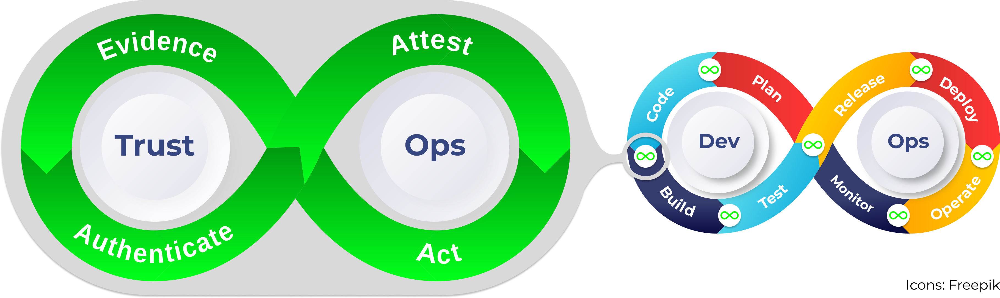
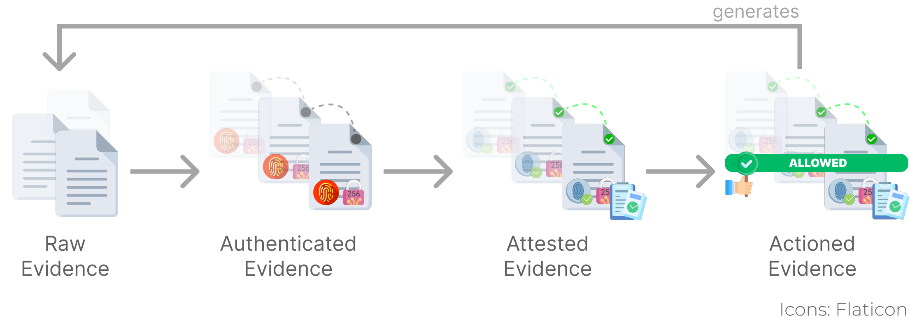

# Awesome TrustOps 

> A list of tools and methods for building trustworthy software following TrustOps principles.

TrustOps is an emerging discipline focused on integrating trust and security practices across the software development lifecycle. TrustOps emphasizes automating evidence collection, authentication, attestation, and the continuous verifiability of the software supply chain to ensure that the software remains trustworthy throughout its lifecycle. The following tools and projects will help build secure, trusted software through various phases of TrustOps. Read more about TrustOps [here](https://github.com/trustops/).

## Contents

- [Awesome TrustOps ](#awesome-trustops-)
  - [Contents](#contents)
  - [Phases](#phases)
    - [Plan](#plan)
    - [Code](#code)
    - [Build](#build)
    - [Test](#test)
    - [Release](#release)
    - [Deploy](#deploy)
    - [Operate](#operate)
    - [Monitor](#monitor)
  - [Evidence Life cycle](#evidence-life-cycle)
    - [Collect](#collect)
    - [Authenticate](#authenticate)
    - [Attest](#attest)
    - [Act](#act)
  - [News and Posts](#news-and-posts)
  - [Contribute](#contribute)

## Phases

### Plan

- [CNCF Cloud Native Security Whitepaper](https://github.com/cncf/tag-security/blob/3e57e7c472f7053c693292281419ab926155fe2d/community/resources/security-whitepaper/v2/CNCF_cloud-native-security-whitepaper-May2022-v2.pdf) - Comprehensive guide to planning secure, cloud-native applications and understanding the risks at every stage.

### Code

- [Chalk](https://github.com/crashappsec/chalk) - A tool that captures and embeds metadata into build artifacts, enabling identification and traceability in production environments.
- [SecretFlow](https://github.com/secretflow) - A framework for secure multi-party computation (MPC), helping you build secure, privacy-preserving data analytics and AI development with confidential computing mechanisms.

### Build

- [GitHub Artifact Attestations](https://github.blog/changelog/2024-06-25-artifact-attestations-is-generally-available/) - A feature to ensure that build artifacts are tamper-proof and verifiable.
- [Nixpkgs Supply Chain Security Project](https://discourse.nixos.org/t/nixpkgs-supply-chain-security-project/34345) - NixOs security initiative focused on securing the software supply chain for the Nixpkgs project.
- [Reproducible Builds](https://reproducible-builds.org/) - A project advocating for reproducible build practices across the software supply chain.
- [Chalk](https://github.com/crashappsec/chalk) - A tool that captures and embeds metadata into build artifacts, enabling identification and traceability in production environments.
- [in-toto](https://in-toto.io/) - A framework to secure the integrity of software supply chains.

### Test

- [OWASP SecureCodeBox](https://owasp.org/www-project-securecodebox/) - A security-testing toolchain that focuses on continuous security testing in CI/CD pipelines.

### Release

- [Sigstore](https://www.sigstore.dev/) - Tools for signing, verifying, and protecting software supply chain components.
- [Artifact Attestation for GitHub](https://github.blog/security/supply-chain-security/configure-github-artifact-attestations-for-secure-cloud-native-delivery/) - Automates the release of artifacts with attestations to ensure that they are secure and unmodified.
- [Notary](https://notaryproject.dev/) - Signing and verifying artifacts. Safeguarding the software delivery security from development to deployment.
- [The Update Framework](https://theupdateframework.io/) - A framework for securing software update systems.

### Deploy

- [Microsoft CCF (Confidential Consortium Framework)](https://github.com/microsoft/CCF) - Provides a secure environment for running distributed applications using confidential computing principles.
- [Confidential Containers](https://github.com/confidential-containers/confidential-containers/) - Kubernetes-based data-in-use integrity, authenticity and confidentiality protection for sensitive workloads when released into production environments.
- [Private Cloud Compute](https://security.apple.com/blog/private-cloud-compute/) - Apple's vision for ensuring verifiable transparency, privacy and security when deploying sensitive applications.

### Operate

- [Nitro System Confidential Protections](https://www.youtube.com/watch?v=jAaqfeyvvSE&t=2143s) - Amazon's Nitro System ensuring that the infrastructure and applications remain secure during operations.

### Monitor

...

## Evidence Life cycle

### Collect

- [Chalk](https://github.com/crashappsec/chalk) - A tool that captures and embeds metadata into build artifacts, enabling identification and traceability in production environments.

### Authenticate

- [GitHub Artifact Attestations](https://github.blog/changelog/2024-06-25-artifact-attestations-is-generally-available/) - A feature to ensure that build artifacts are tamper-proof and verifiable.
- [Sigstore](https://www.sigstore.dev/) - Tools for signing, verifying, and protecting software supply chain components.
- [Notary](https://notaryproject.dev/) - Signing and verifying artifacts. Safeguarding the software delivery security from development to deployment.

### Attest

- [Artifact Attestations](https://github.blog/security/supply-chain-security/configure-github-artifact-attestations-for-secure-cloud-native-delivery/) - Verifies that all software artifacts have been attested to by their creators, ensuring their integrity.
- [Attest.org](https://attest.org/) - Ethereum Attestation Service (EAS) is an infrastructure designed to create attestations on-chain or off-chain about any subject or event, providing a public good for decentralized verification and trust.
- [in-toto](https://in-toto.io/) - A framework to secure the integrity of software supply chains.

### Act

- [Kyverno](https://kyverno.io/) - Kyverno policies can validate, mutate, generate, and cleanup Kubernetes resources, and verify image signatures and artifacts to help secure the software supply chain.

## News and Posts

- [Linus Torvalds on Security](https://thenewstack.io/linus-torvalds-on-security-ai-open-source-and-trust/) - Discussion on monitoring and maintaining trust in open-source software ecosystems.
- [Private Cloud Compute](https://security.apple.com/blog/private-cloud-compute/) - Apple's vision for ensuring verifiable transparency, privacy and security when deploying sensitive applications.
- [Dependency Security](https://www.devsecurely.com/blog/2023/11/securing-the-building-blocks-a-deep-dive-into-dependency-security) - A deep dive into securing dependencies during software development and build processes.

## Contribute

Contributions welcome! Read the [contribution guidelines](contributing.md) first.